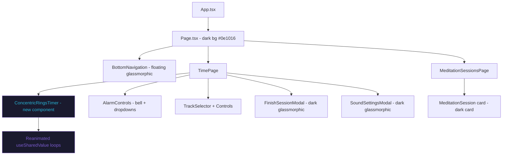
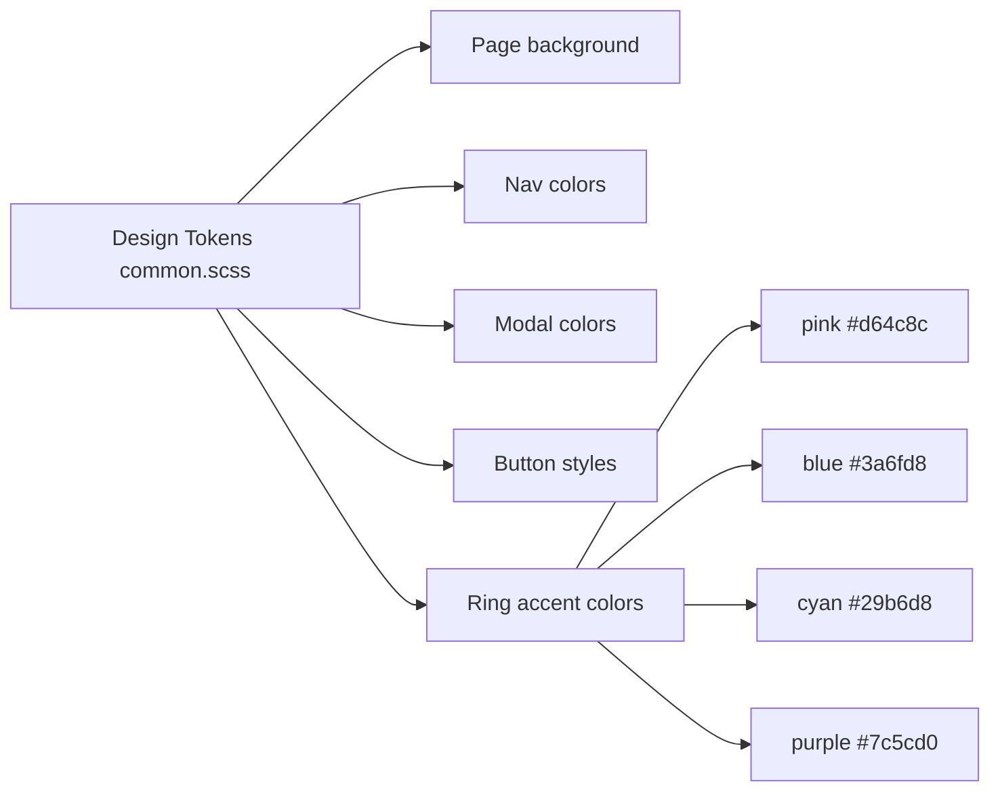
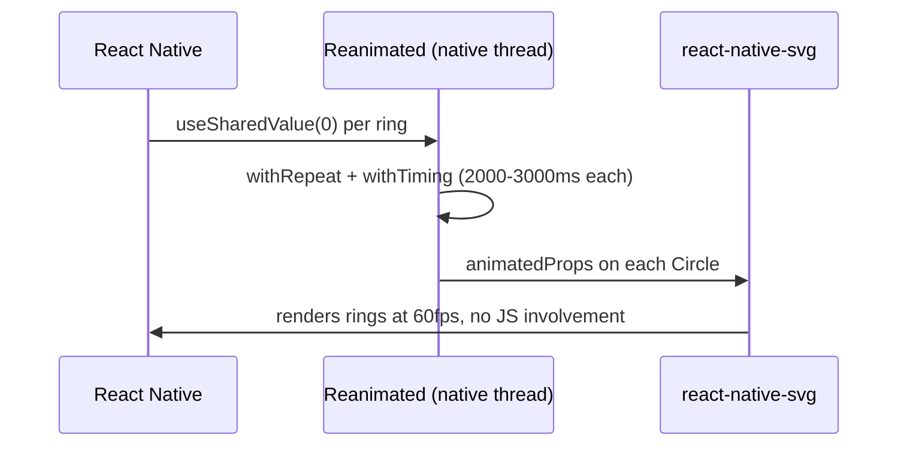

# TDD: Complete UI Redesign

## Introduction

The app requires a complete visual overhaul to match the new design created in `ux-design/new-design.html`. The current UI uses a flat dark-gray (#252525) palette with a plain circular timer border. The new design introduces a deep navy-black background, animated concentric colored rings as the central timer visual, glassmorphic modals, and a modern floating bottom navigation — transforming the app from utilitarian to immersive.

All components must be updated: color tokens, timer, navigation, modals, session cards, dropdowns, and icon library.

---

## Goals and Non-Goals

**Goals:**
- Match the new design pixel-for-pixel across all screens and states
- Replace FontAwesome icons with `react-native-vector-icons` (MaterialIcons / MaterialCommunityIcons) for a modern icon set
- Implement performant concentric-ring animation using `react-native-reanimated` (not Animated API)
- Update all SCSS color tokens from gray → new palette
- Dark glassmorphic modals, floating bottom nav, session card redesign
- All animations run on the native thread (no JS-thread jank)

**Non-Goals:**
- New features or data model changes
- Audio system changes
- Navigation structure changes (still Timer + Sessions tabs)
- iOS-specific SafeArea changes beyond what already exists

---

## Problem Statement

The current design:
- Uses a single gray dark theme with no visual identity
- Timer is a plain bordered circle with text — no visual feedback during active meditation
- Bottom nav is a plain horizontal row of icon buttons
- Modals are white/light — inconsistent with the dark theme
- FontAwesome icon set feels dated vs. modern Material icons
- No ambient animation to reinforce the meditative atmosphere

This creates a disconnect between the app's purpose (calm, immersive meditation) and its visual design (functional but stark).

---

## Architectural Overview





---

## Detailed Technical Sections

### 1. Design Token Overhaul (`src/style/common.scss`)

| Token | Old Value | New Value |
|---|---|---|
| `$bgColor` | `rgb(37,37,37)` | `#0e1016` |
| `$accentPink` | — | `#d64c8c` |
| `$accentBlue` | — | `#3a6fd8` |
| `$accentCyan` | — | `#29b6d8` |
| `$accentPurple` | — | `#7c5cd0` |
| `$textPrimary` | `white` | `#ffffff` |
| `$textSecondary` | `rgb(209,209,210)` | `rgba(255,255,255,0.55)` |
| `$navBg` | `rgb(42,42,42)` | `rgba(14,16,22,0.85)` |
| `$glassCard` | — | `rgba(255,255,255,0.06)` |
| `$glassBorder` | — | `rgba(255,255,255,0.1)` |
| `$modalBg` | `rgba(0,0,0,0.7)` | `rgba(0,0,0,0.85)` |
| `$modalWindowBg` | `white` | `rgba(20,22,32,0.95)` |

---

### 2. ConcentricRingsTimer (New Component)

**File:** `src/common-components/ConcentricRingsTimer.tsx`

The centerpiece of the redesign. Renders 4 concentric `react-native-svg` `Circle` elements that animate continuously using `react-native-reanimated` worklets.



**Ring specs (from design SVG):**
- Ring 1: r=150, stroke `#d64c8c` (pink), rotation offset 0°
- Ring 2: r=172, stroke `#3a6fd8` (blue), rotation offset 45°  
- Ring 3: r=158, stroke `#29b6d8` (cyan), rotation offset 90°
- Ring 4: r=178, stroke `#7c5cd0` (purple), rotation offset 135°
- All rings: strokeWidth=10, opacity=0.55
- White orb (r=13, fill `#fff`) orbits Ring 1 at current angle

**Animation approach:**
- Each ring uses `useSharedValue` + `withRepeat(withTiming(...))` for rotation
- Slightly different durations (8s, 10s, 12s, 9s) create organic desync
- `useAnimatedProps` pipes `rotation` → SVG `transform` prop
- All runs on native thread — no `useNativeDriver` needed (Reanimated 3 default)
- Timer text (`00:00:00`) rendered as `Text` centered over the SVG via `absoluteFill`

---

### 3. TimePage Layout Changes

**Current:** Two rows — alarm controls + circular timer in row 1; track selector + play/finish buttons in row 2.

**New:**
- Full-screen centered `ConcentricRingsTimer` as background/hero
- Alarm controls (bell icon + hour/min dropdowns) anchored top-center with glass pill styling
- Play/Pause and Finish buttons below the timer (floating pill buttons)
- Track selector as a compact pill at the bottom

---

### 4. Icon Library Migration

Replace `@fortawesome/react-native-fontawesome` with `react-native-vector-icons`.

| Usage | Old FA Icon | New Icon (MaterialCommunityIcons) |
|---|---|---|
| Bell (alarm) | `faBell` | `bell-outline` / `bell` |
| Play | `faPlay` | `play` |
| Pause | `faPause` | `pause` |
| Settings gear | `faGear` | `cog-outline` |
| Save | `faSave` | `content-save-outline` |
| Close | `faClose` | `close` |
| Delete | `faTrash` | `trash-can-outline` |
| Timer tab | `faOm` | `meditation` |
| Sessions tab | `faVihara` | `history` |

**Implementation:** Update `IconButton.tsx` to accept icon name string and use `MaterialCommunityIcons` from `react-native-vector-icons/MaterialCommunityIcons`.

---

### 5. BottomNavigation Redesign

- Floating pill container: `borderRadius: 40`, `backdropFilter`-style dark glass bg
- Horizontally centered (not left-aligned)
- Active tab icon gets accent color glow (text shadow / colored icon)
- Inactive: `rgba(255,255,255,0.4)`
- Active: accent color (pink or cyan alternating per tab)

---

### 6. Modal Redesign

- Overlay: `rgba(0,0,0,0.85)` (darker than current)
- Window: `rgba(20,22,32,0.95)` with `borderRadius: 20` and `1px rgba(255,255,255,0.1)` border
- Text: white primary, `rgba(255,255,255,0.6)` secondary
- Inputs: dark bg (`rgba(255,255,255,0.08)`), white text, glass border
- Buttons: accent-colored (blue for primary, glass for cancel)
- Star rating: accent pink/gold
- Close button icon: white

**Affected modals:** `Modal.tsx`, `FinishSessionModal.tsx`, `SoundSettingsModal.tsx`, `TrackModalSelector.tsx`, `ScheduledTrackBuilder.tsx`, `ScheduledSoundBuilder.tsx`

---

### 7. MeditationSession Card Redesign

- Card background: `rgba(255,255,255,0.06)` glass
- Border: `1px rgba(255,255,255,0.1)` 
- `borderRadius: 16`
- Date text: white, duration text: accent cyan
- Star rating: accent pink (small)
- Notes text: `rgba(255,255,255,0.6)`
- Swipe-delete reveal: dark red (`#8B1A1A`) background, white trash icon

---

### 8. Dropdown Redesign

- `DropDown.tsx`: dark bg, white text, glass border, accent highlight on selected
- `TDropDown.tsx`: same treatment

---

## Alternatives Considered

### Option A: Lottie animation for rings
- **Pro:** Richer, designer-controlled animation
- **Con:** Requires Lottie file creation, additional dependency, overkill for SVG circles
- **Decision:** Rejected — Reanimated + SVG circles is simpler and sufficient

### Option B: Keep FontAwesome, just update colors
- **Pro:** Zero migration cost
- **Con:** FontAwesome for RN icon set is outdated; design calls for cleaner line icons
- **Decision:** Rejected — MaterialCommunityIcons covers all needed icons and is already installed

### Option C: Use `react-native-linear-gradient` for ring strokes
- **Pro:** More accurate gradient ring glow
- **Con:** Complex implementation; solid colored rings match the reference design
- **Decision:** Deferred — solid color rings match the SVG preview exactly

---

## File Change Map

```
src/style/common.scss                              ← token overhaul
src/style/common-components/page.scss             ← bg color
src/style/common-components/bottom-navigation.scss ← floating pill nav
src/style/common-components/button.scss            ← dark accent buttons
src/style/common-components/icon-button.scss       ← transparent + accent
src/style/common-components/modal.scss             ← dark glass modal
src/style/common-components/dropdown.scss          ← dark glass dropdown
src/style/common-components/modal-selector.scss    ← dark glass
src/style/common-components/track-modal-selector.scss ← dark glass
src/style/components/time-page/time-page.scss      ← full restyle
src/style/components/time-page/finish-session-modal.scss ← dark
src/style/components/time-page/sound-settings-modal.scss ← dark
src/style/components/meditation-page/meditation-session.scss ← glass card
src/style/components/meditation-page/meditation-sessions-page.scss ← bg

src/common-components/ConcentricRingsTimer.tsx     ← NEW component
src/common-components/IconButton.tsx               ← switch to vector-icons
src/common-components/BottomNavigation.tsx         ← floating pill
src/common-components/Page.tsx                     ← dark bg
src/common-components/Modal.tsx                    ← dark glass
src/common-components/Button.tsx                   ← accent style
src/components/time-page/TimePage.tsx              ← new layout
src/components/time-page/FinishSessionModal.tsx    ← dark modal
src/components/time-page/SoundSettingsModal.tsx    ← dark modal
src/components/meditation-sessions-page/MeditationSession.tsx ← glass card
src/components/meditation-sessions-page/MeditationSessionsPage.tsx ← bg
```

---

## Testing Strategy

### Manual visual verification (primary)
- Run on Android emulator, screenshot each screen and compare against `ux-design/new-design.html` SVG preview
- Verify rings animate continuously at ~60fps without JS jank
- Verify timer text is readable over rings at all durations
- Verify all modals open/close with correct dark glass appearance
- Verify swipe-to-delete works on session cards

### Automated — existing E2E tests must still pass
- `__tests__/` / `e2e/` Maestro flows: start session, finish session, view sessions
- Run: `yarn test` (Jest unit tests for EventBus, proxyUseState)

### Animation performance check
- Enable Reanimated debug overlay; confirm ring transforms run on UI thread (green, not red)
- Verify no dropped frames during simultaneous timer update + ring rotation
