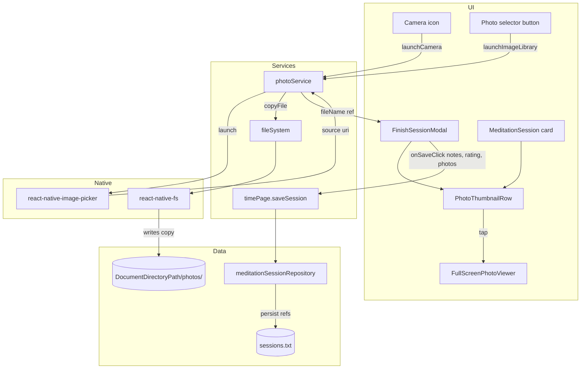
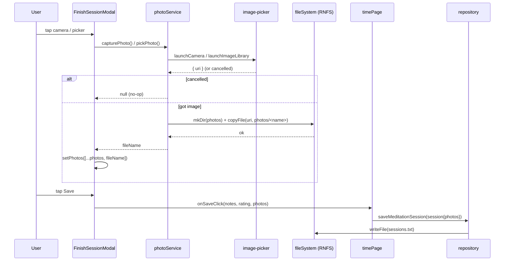

# TDD: Session Photos (Capture & Attach)

## Introduction

Users want to attach photos to a meditation session as part of the finish/save flow — either by taking a new picture (camera) or selecting an existing one from their device. The finish modal will gain a camera icon and a photo‑selector button above the Save button. Saved sessions on the Sessions screen will show photo thumbnails, and tapping a thumbnail opens it full screen.

Crucially, photos must survive the user deleting the original from their camera roll. So on attach we **copy** the source image into the app's own data directory (`DocumentDirectoryPath/photos/`) and the session stores only a reference to that copy. This document covers the data model change, the photo service, the UI additions, and the testing strategy.

## Goals and Non-Goals

### Goals
- Camera icon in `FinishSessionModal` (above Save) that launches the device camera and attaches the resulting photo.
- Photo‑selector button in `FinishSessionModal` (above Save) that launches the gallery picker and attaches a selected photo.
- Every attached photo is **copied** into `DocumentDirectoryPath/photos/` before the session is saved; the session persists a reference to the copy, never the original camera‑roll URI.
- `MeditationSession` list cards render photo thumbnails for the session.
- Tapping any thumbnail opens a full‑screen viewer.
- Deleting a session deletes its copied photo files (no orphaned files).
- A session can have multiple photos.

### Non-Goals
- Cloud backup / sync of photos.
- Photo editing, cropping, filters, or annotation.
- Video capture.
- Re‑compression/resizing beyond what the picker provides (may revisit for storage size).
- Editing photos of an already‑saved session (attach happens only during the finish flow for v1). *(Open to a follow‑up.)*

## Problem Statement

Today a session (`IMeditationSession`) captures only `id`, `dateMs`, `durationMs`, `notes`, `rating`. The finish flow (`TimePage` → `FinishSessionModal` → `timePage.saveSession` → `meditationSessionRepository`) has no concept of media, and the Sessions list (`MeditationSession.tsx`) renders only date/duration/stars/notes.

Users who want a visual journal of where/how they meditated have no way to associate an image with a session. Even if we just stored the camera‑roll URI, those URIs are unstable: the user can delete the photo, the OS can relocate it, and on iOS the sandbox path changes across reinstalls. Without copying the bytes into our own data directory, attached photos would silently break.

## Architectural Overview



## Detailed Technical Sections

### Components and Interfaces

#### 1. Data model — `src/models/IMeditationSession.ts`
Add a `photos` field. Store **only the file name** (relative), not an absolute path, because `DocumentDirectoryPath` can change across reinstall/OS migration. Absolute paths are resolved at render time.

```typescript
export default interface IMeditationSession {
    id: string,
    dateMs: number,
    durationMs: number,
    notes: string,
    rating: number,
    photos?: string[], // file names only, e.g. "1718600000000-ab12.jpg"; absolute = baseDirectory/photos/<name>
}
```

Helper exported from the same module:

```typescript
/** Resolve a stored photo file name to an absolute on-disk path under the app data dir. */
export function getPhotoPath(fileName: string): string
```

> `photos` is optional so existing persisted sessions (no field) deserialize unchanged — no migration needed.

#### 2. `src/services/photoService.ts` (new)
Wraps `react-native-image-picker` + the copy-into-data-dir logic. The UI never sees raw camera‑roll URIs.

```typescript
const PHOTOS_DIR = baseDirectory + '/photos';

/** Launch the camera, copy the captured image into the app photos dir, return the stored file name (or null if cancelled). */
async function capturePhoto(): Promise<string | null>

/** Launch the gallery picker, copy the chosen image into the app photos dir, return the stored file name (or null if cancelled). */
async function pickPhoto(): Promise<string | null>

/** Copy a source uri into PHOTOS_DIR under a unique name; returns the new file name. */
async function copyIntoDataDir(sourceUri: string): Promise<string>

/** Delete the copied files for the given file names (best-effort, ignores missing). */
async function deletePhotos(fileNames: string[]): Promise<void>
```

- Unique file name: `${Date.now()}-${shortRandom}.${ext}` (extension derived from source uri/type).
- `copyIntoDataDir` ensures `PHOTOS_DIR` exists (`fileSystem.mkDir`) then `fileSystem.copyFile`.

#### 3. `src/services/fileSystem.ts`
Add thin wrappers over RNFS (mirrors existing `writeFile`/`readFile`/`mkDir`):

```typescript
async copyFile(sourcePath: string, destPath: string): Promise<void>  // RNFS.copyFile
async unlink(path: string): Promise<void>                            // RNFS.unlink, ignore ENOENT
async exists(path: string): Promise<boolean>                         // RNFS.exists
```

#### 4. `FinishSessionModal.tsx`
- New local state `const [photos, setPhotos] = useState<string[]>([])`.
- New `rowFour` (above the existing Save row, which becomes `rowFive`) containing:
  - Camera icon button — `testID="capture-photo-button"` → `photoService.capturePhoto()` → append result to `photos`.
  - Photo‑selector button — `testID="pick-photo-button"` → `photoService.pickPhoto()` → append result.
  - `PhotoThumbnailRow` showing currently‑attached thumbnails (with a small remove "×" per thumbnail that calls `photoService.deletePhotos([name])` and removes from state).
- `handleSave` passes photos through: `onSaveClick(notesRef.current, rating, photos)`.
- Props change: `onSaveClick?: (notes: string, rating: number, photos: string[]) => void`.

#### 5. `PhotoThumbnailRow.tsx` (new, reused in modal + card)
```typescript
type Props = {
    photos: string[],                         // file names
    onThumbnailClick?: (index: number) => void,
    onRemoveClick?: (fileName: string) => void, // only passed in the modal (edit mode)
};
```
Renders horizontal `Image` thumbnails using `{ uri: 'file://' + getPhotoPath(name) }`. `testID="session-thumbnail-<index>"`.

#### 6. `FullScreenPhotoViewer.tsx` (new)
A `Modal`-based full‑screen viewer; given `photos` + start `index`, shows the image full screen with close (and optional horizontal swipe between photos). `testID="fullscreen-photo-viewer"`.

#### 7. `MeditationSession.tsx`
- Below notes (`rowThree`), conditionally render `PhotoThumbnailRow` when `meditationSession.photos?.length`.
- Thumbnail tap opens `FullScreenPhotoViewer` (local `useState` for open/index).

#### 8. `src/services/timePage.ts`
`saveSession` accepts photos and stores them on the session before persisting:

```typescript
async saveSession(notes: string, rating: number, photos: string[] = []) {
    ...
    session.notes = notes;
    session.rating = rating;
    session.photos = photos;
    await meditationSessionRepository.saveMeditationSession(session);
    ...
}
```
`TimePage.tsx` wiring: `onSaveClick={(notes, rating, photos) => timePage.saveSession(notes, rating, photos)}`.

#### 9. `meditationSessionRepository.ts`
`deleteMeditationSession` must also delete copied files:

```typescript
const session = dataContainer.meditationSessions[index];
if (session.photos?.length) { await photoService.deletePhotos(session.photos); }
// ...then splice + save as today
```

#### Dependencies / native config
- Add `react-native-image-picker` (bare RN; returns `assets[].uri`, supports `launchCamera` + `launchImageLibrary`).
- Android: `CAMERA` permission in `AndroidManifest.xml`; gallery uses the system photo picker (no runtime permission on Android 13+).
- iOS: `NSCameraUsageDescription` + `NSPhotoLibraryUsageDescription` in `Info.plist`.
- Jest: add `react-native-image-picker` mock in `jest.setup.js`; extend the existing RNFS mock with `copyFile`, `unlink`, `exists`.

### Data Flows and Security

#### Attach + save (happy path)


#### Error handling & risks
| Risk | Handling |
|------|----------|
| User cancels picker | `photoService` returns `null`; modal does nothing. |
| Permission denied (camera/gallery) | picker returns `didCancel`/`errorCode`; show a brief inline message, no crash. |
| `copyFile` fails (disk full / bad uri) | catch in `photoService`, return `null`, log + surface non‑blocking error; session still saveable without that photo. |
| Orphaned files (photo attached, save cancelled via X) | On modal close without save, call `photoService.deletePhotos(photos)` for the not‑yet‑persisted set. |
| Orphaned files on session delete | `deleteMeditationSession` deletes referenced files (best‑effort). |
| Stale absolute paths across reinstall | Store **file name only**; resolve via `getPhotoPath` at render — robust to `DocumentDirectoryPath` changes. |
| Missing file at render (manually deleted) | `Image` shows nothing/onError fallback; no crash. |
| Privacy | Photos stay in app‑private storage (`DocumentDirectoryPath`); never uploaded anywhere. |

## Alternatives Considered

| Option | Pros | Cons | Decision |
|--------|------|------|----------|
| **Copy into `DocumentDirectoryPath/photos`, store file name** | Survives camera‑roll deletion; path stable across reinstall; private | Duplicate storage; must clean up on delete | **Chosen** |
| Store original camera‑roll URI only | Zero copy, no extra storage | Breaks if user deletes photo / OS relocates / reinstall — fails the core requirement | Rejected |
| Store absolute copied path | Slightly simpler render | iOS sandbox path changes across reinstall → broken refs | Rejected |
| Base64‑embed photos in `sessions.txt` | Single file, atomic | Bloats JSON, slow reads, memory heavy, no thumbnailing | Rejected |
| `react-native-image-picker` | One lib for camera + gallery, bare‑RN friendly, widely used | Native rebuild + permissions config | **Chosen** |
| `expo-image-picker` | Clean API | Project is bare RN, not Expo — adds friction | Rejected |
| Separate `photos.txt` index file | Decouples media metadata | Extra file + sync complexity for little gain at this scale | Rejected |

## Testing Strategy

Favor functional/integration tests with `@testing-library/react-native` (existing setup), plus a Detox e2e. Mock `react-native-image-picker` and extend the RNFS mock in `jest.setup.js`.

### Integration — `FinishSessionModal.test.tsx` (extend)
1. **Camera attach**: mock `photoService.capturePhoto` → resolves `'photo-1.jpg'`; press `capture-photo-button`; assert a thumbnail (`session-thumbnail-0`) renders.
2. **Gallery attach**: mock `pickPhoto` → `'photo-2.jpg'`; press `pick-photo-button`; assert thumbnail renders.
3. **Save passes photos**: attach one photo, press Save; assert `onSaveClick` called with `(notes, rating, ['photo-1.jpg'])`.
4. **Save with no photos**: press Save without attaching; assert `onSaveClick` called with `(..., [])` (back‑compat).
5. **Cancelled picker**: `capturePhoto` resolves `null`; press button; assert no thumbnail added.
6. **Remove before save**: attach, then tap remove "×"; assert thumbnail gone and `photoService.deletePhotos` called.
7. **Close without save cleans up**: attach, press close (X); assert `deletePhotos` called with the attached names.

### Integration — `photoService.test.ts` (new)
1. `copyIntoDataDir` calls `fileSystem.mkDir(photosDir)` then `fileSystem.copyFile(sourceUri, photosDir/<name>)` and returns the generated file name (unique, correct extension).
2. `capturePhoto`/`pickPhoto` return `null` when picker reports `didCancel`.
3. `capturePhoto`/`pickPhoto` return `null` and log when picker reports an `errorCode`.
4. `deletePhotos` calls `fileSystem.unlink` for each name and swallows ENOENT (missing file does not throw).

### Integration — `MeditationSession.test.tsx` (new/extend)
1. Renders N thumbnails when `photos` has N entries; renders none when `photos` is empty/undefined.
2. Tapping `session-thumbnail-0` opens `fullscreen-photo-viewer`.
3. Viewer close button hides the viewer.

### Integration — repository
1. `deleteMeditationSession` on a session with photos calls `photoService.deletePhotos(session.photos)` before persisting.
2. Sessions persisted **without** `photos` (legacy) deserialize and render without error.

### E2E — `e2e/sessionPhotos.test.js` (new, Detox)
Extends `saveSession.test.js`. Camera/gallery permission dialogs and the native picker are stubbed/auto‑granted via Detox launch args (`permissions: { camera: 'YES', photos: 'YES' }`); the picker result is mocked at the native bridge or via a debug hook so CI is deterministic.
1. Finish → modal visible → tap `capture-photo-button` → thumbnail appears in modal → Save → modal dismisses.
2. Navigate to Sessions tab → the saved session card shows `session-thumbnail-0`.
3. Tap thumbnail → `fullscreen-photo-viewer` visible → close.

### Manual verification (Android emulator)
- Camera capture writes a file under `DocumentDirectoryPath/photos/` (confirm via `adb`/RNFS log).
- Delete the original from the gallery → session thumbnail still loads from the copy.
- Delete the session → its files removed from `photos/`.
